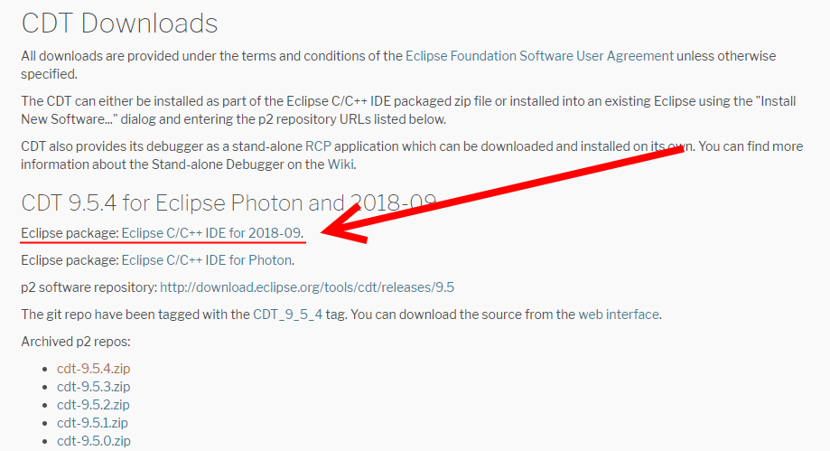
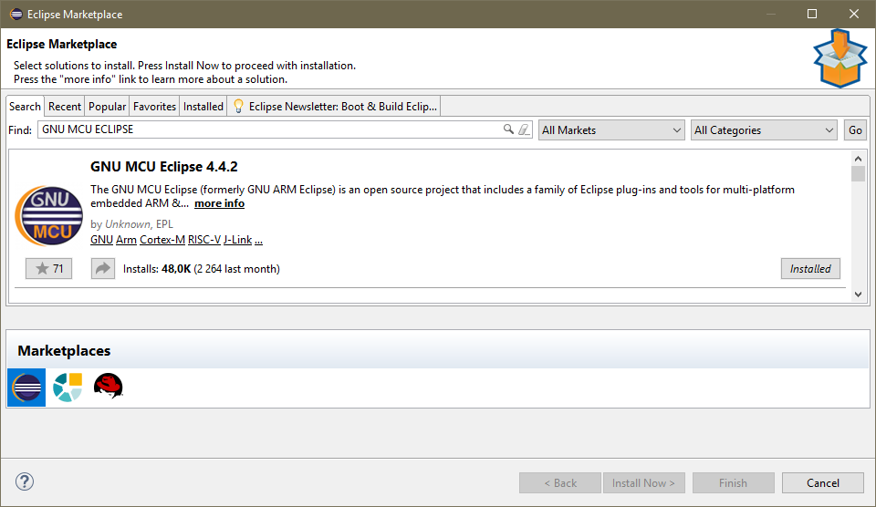
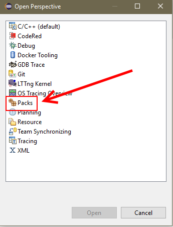
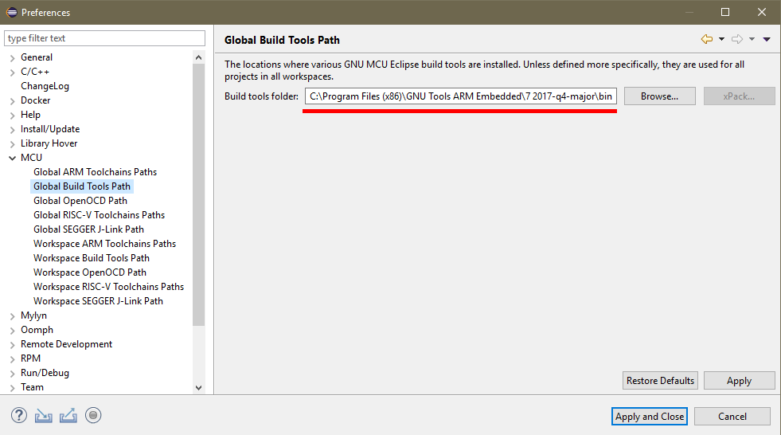
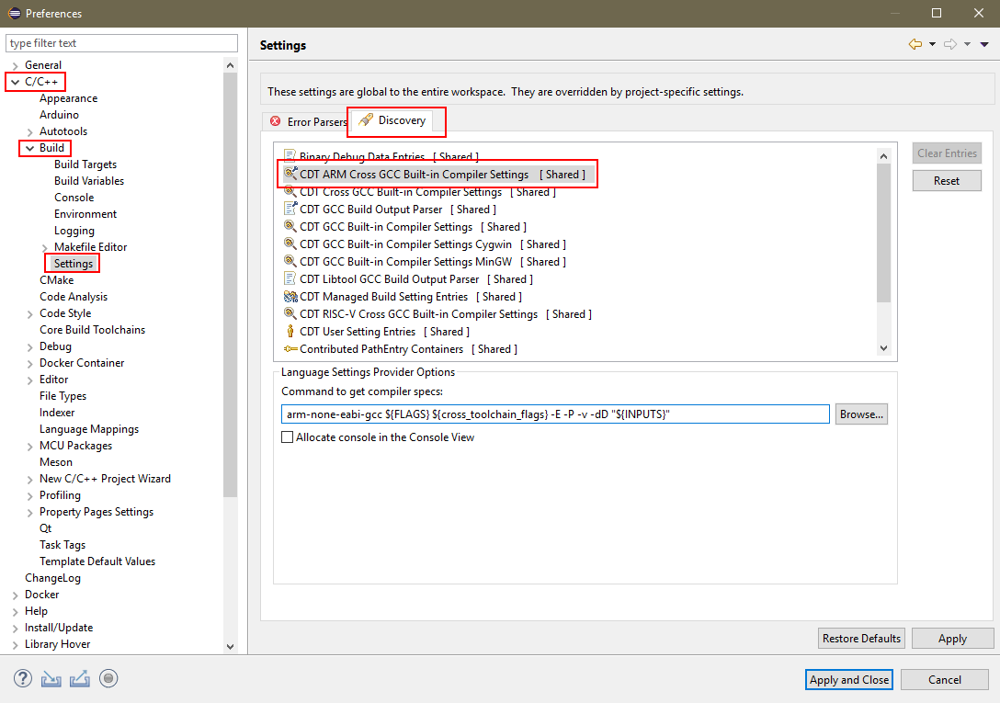
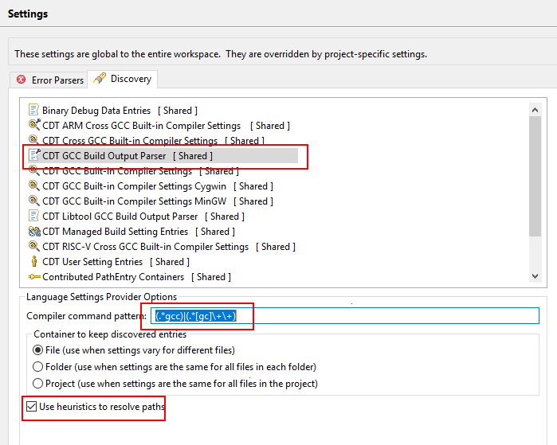

# ARM Development with GCC and Eclipse

## Software

* [Eclipse IDE 2018-09](http://www.eclipse.org/)
  * [C/C++ IDE 9.4](www.eclipse.org/cdt/downloads.php): *Install from Eclipse website*
  * [GNU MCU Eclipse](www.https://gnu-mcu-eclipse.github.io/): *Install from Eclipse Marketplace*
    * GNU ARM C/C++ Cross Compiler
    * GNU ARM C/C++ Packs
    * GNU ARM C/C++ J-link Debugging
* [GNU Arm Embedded Toolchain](www.developer.arm.com/open-source/gnu-toolchain/gnu-rm)

### Windows

Minimum required command line tools are `make`/`sh`/`rm`/`echo`.  You can get them either in one of the two following packages.

* [GNU MCU Eclipse Windows Build](www.github.com/gnu-mcu-eclipse/windows-build-tools/releases)

* [MSYS MinGW](www.mingw.org/wiki/msys): *Don't forget to put the `bin` folder in windows **PATH** to have access to make everywhere*.

## Setting Up Eclipse

### Install Eclipse C/C++ IDE

Install the IDE and C/C++ from Eclipse website. Version used in this tutorial is `9.5.4`.

### Install tools from Marketplace

First install from eclipse marketplace (`Help->Eclipse MarketPlace...` then `Search` tab, write the plugin name inside the `Find:` field).

* **GNU MCU Eclipse**: The GNU MCU Eclipse (formerly GNU ARM Eclipse) is an open source project that includes a family of Eclipse plug-ins and tools for multi-platform embedded ARM & RISC-V development, based on GNU toolchains.

### Install MCU Packs

The device family pack includes CMSIS System View Description, which is basically is a memory map of all peripheral registers on the device. Although it is not required to have installed it can be quite useful for debugging purposes; it allows you to easily read and write to particular peripherals through a built in peripheral viewer (part of GNU ARM Eclipse Plug-in) without having to look up the the addresses and register descriptions in the datasheet first.

After installing MCU Eclipse a new Perspective will be available. To open it: `Window->Perspective->Open Perspective->Other ...`. Then choose Pack perspective.

Then press refresh in the Packs main window.

The refresh might take a while. If a repository timeout choose ignore all. When repositories are sync installed packs that suit your needs.

### Configure GNU MCU Eclipse

Download and install [GNU Arm Embedded Toolchain](https://developer.arm.com/open-source/gnu-toolchain/gnu-rm).

Open eclipse global Preferences in `Window->Preferences`. Then go to MCU and set the ARM Toolchains Paths and Build Tools Paths to where Arm toolchain is installed.

Then in order to allow Eclipse to find all symbols and paths for the Makefile Project go into (still in Preferences) `C/C++->Build->Settings` then tab `Discovery`. 

There you will edit `CDT Arm Cross GCC Build-in Compiler Settings` command to get compiler specs by `arm-none-eabi-gcc ${FLAGS} ${cross_toolchain_flags} -E -P -v -dD "${INPUTS}"`.

Also modify `CDT GCC Build Output Parset` command pattern with `(.*gcc)|(.*[gc]\+\+)`.

## How to import a Makefile project

## Links

* [Development with GCC and Eclipse](https://devzone.nordicsemi.com/tutorials/b/getting-started/posts/development-with-gcc-and-eclipse)

### MSYS2

https://github.com/njzhangyifei/msys2-mingw-shortcut-menus

https://github.com/msys2/msys2/wiki

### OpenOCD

https://docs.espressif.com/projects/esp-idf/en/latest/api-guides/jtag-debugging/building-openocd-windows.html

